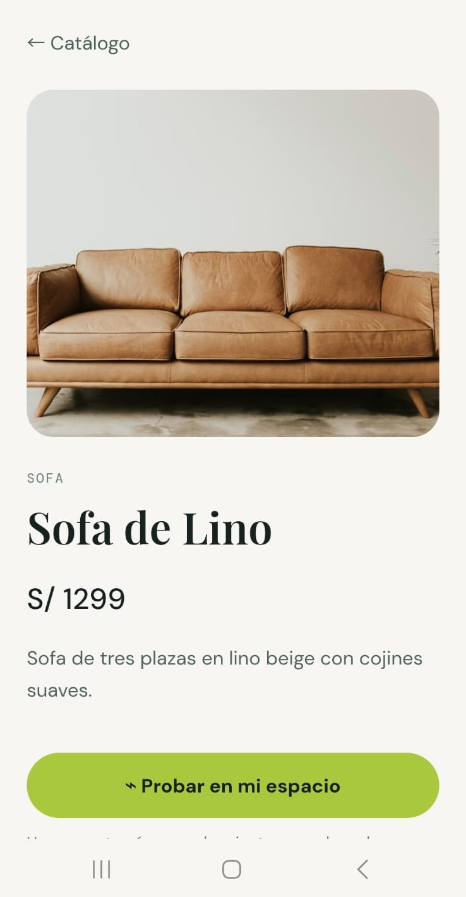
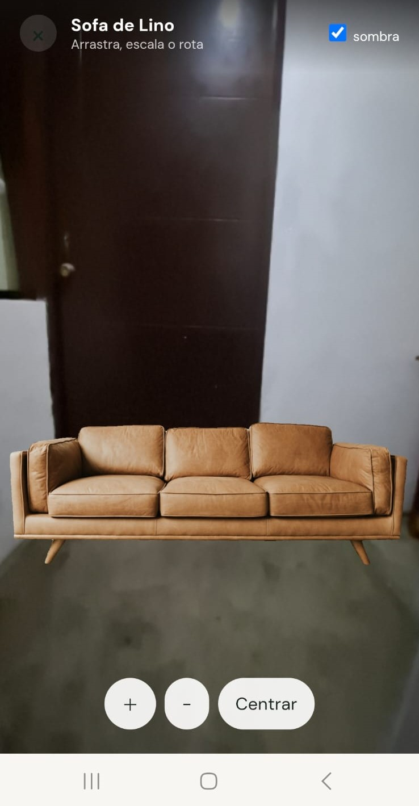

# Marketplace Vision AI: "Prueba este producto en tu espacio"

## 1. Resumen

Este proyecto implementa una web app orientada a dispositivos móviles que permite visualizar productos en el entorno real mediante la cámara del celular. El sistema integra un servicio de segmentación de imágenes con SAM 3, expuesto mediante una API REST desarrollada con FastAPI. La aplicación recibe imágenes de productos, identifica y segmenta los objetos presentes, y utiliza sus máscaras para aislarlos y visualizarlos de forma interactiva sobre la cámara del dispositivo. Los resultados de segmentación se transmiten mediante PNG codificado en Base64. El proyecto sirve como una introducción práctica a Computer Vision y AI Engineering, mostrando cómo integrar un modelo de IA con un backend y una aplicación web móvil para desarrollar una experiencia interactiva basada en visión por computadora.

<p align="center">
  
  
  
</p>

## 2. Instrucciones para probarlo localmente

### 2.1. Clonar el repositorio

```shell
git clone https://github.com/andrewkc/workshop-sam.git
cd workshop-sam
```

### 2.2. Frontend

Instalar dependencias y ejecutar el servidor:

```shell
cd frontend
npm install
npm run dev
```

El frontend estará disponible en `http://localhost:5173`.

### 2.3. Crear un puente con ngrok

Para el taller, utilizaremos **ngrok** para exponer el frontend localmente.

1. Crear una cuenta en [ngrok](https://ngrok.com/) y descargarlo.

2. Configurar el token de autenticación:

```shell
ngrok config add-authtoken YOUR_TOKEN
```

3. Crear el puente HTTP hacia el frontend:

```shell
ngrok http 5173
```

ngrok generará una URL pública para acceder al frontend. Puedes abrir este enlace directamente en el navegador de tu celular para probar el proyecto.

### 2.2. Backend

Se recomienda utilizar **Python 3.13** para ejecutar el backend.

Crear el entorno virtual utilizando Python 3.13:

```shell
cd backend
py -3.13 -m venv .venv # py -m venv .venv
```

Activar el entorno virtual:

```shell
.\.venv\Scripts\Activate.ps1
```

Actualizar `pip`:

```shell
python -m pip install --upgrade pip
```

Instalar las dependencias:

```shell
python -m pip install -r requirements.txt
```

Ejecutar el backend:

```shell
python -m uvicorn app.main:app --reload
```

Si no tienes instalada Python 3.13 o una versión superior y encuentras problemas con las dependencias, puedes descargarla desde python.org.

También puedes instalarla utilizando `winget`:

```shell
winget install Python.Python.3.13
```

Luego, verifica que Python 3.13 esté disponible:

```shell
py -3.13 --version
```

Repite los primeros pasos.

### 2.3. Servidor de inferencia del modelo (en la nube)

Para este taller, utilizaremos **Google Colab** para ejecutar el servidor de inferencia del modelo.

1. Solicitar acceso a los siguientes modelos en Hugging Face antes de utilizarlos, ya que son modelos **open-source gated**:
   - [SAM 3](https://huggingface.co/facebook/sam3)
   - [SAM 3D Objects](https://huggingface.co/facebook/sam-3d-objects)

2. Crear una cuenta de **ngrok** con un correo diferente al utilizado para el frontend, para establecer un túnel HTTP hacia el servidor de inferencia.

3. Copiar los archivos `inference/model.py` e `inference/api.py` al entorno de Google Colab.

4. Ejecutar los comandos de configuración y ejecución definidos en `inference/commands.ipynb`.

Al finalizar, se obtendrá una **URL pública** mediante ngrok que permitirá al backend comunicarse con el servidor de inferencia.
